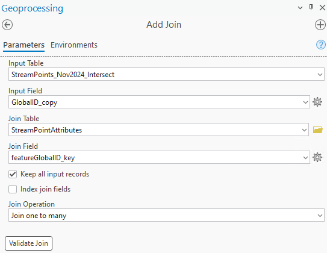

```{r, include = FALSE}
knitr::opts_chunk$set(
  collapse = TRUE,
  comment = "#>"
)
```

# Trash and Dumpsites

### Notes

-   The R functions assess_trash() and assess_dumpsites() require dataframe inputs of processed RSA reach data and RSA point data (dumpsites only)

-   The watershed layer included in RSA database was not used due to issue found. For example, layer "Watersheds_Notes_RSA2021" has missing area in Rock Creek. Instead used: [DC Subwatersheds  Open Data Layer](https://opendata.dc.gov/datasets/dc-subwatersheds/explore?location=38.890772%2C-77.021832%2C12.98&showTable=true).

<br>

### Steps for processing RSA stream reach and point data

1.  In StreamPoints feature layer, copy GlobalID to a new field

    -   Set data type of the new to GUID

    -   New field name suggestion: GlobalID_copy

    -   This step is needed so that the GlobalID information will be included in the intersected table

2.  Intersect [DC Subwatersheds  Open Data Layer](https://opendata.dc.gov/datasets/dc-subwatersheds/explore?location=38.890772%2C-77.021832%2C12.98&showTable=true) with StreamPoints layer

3.  Run the 'Add Attribute Index' tool:

    -   Field to Index: GlobalID_copy

    -   Index Name: GlobalID_index

4.  Join StreamPoints attributes table to StreamPoints feature layer. See settings in screenshot below:

    {width="326"}

5.  Export joined StreamPoints table to Excel

    -   Save file to R package data folder
    -   Update file name input variable in workflow.R file

6.  In the input variables section of workflow.R, update the field name prefix variables (if needed)

7.  Repeat steps 1, 3,4, 5 and 6 using StreamReaches feature layer and attribute table

    -   Skip Step 2 since subshed information is already included as a field in the StreamReaches feature layer

<br>

# Effective Impervious Area (EIA)

### Notes

-   Subshed area calculations done [external]{.underline} to R package. Lookup tables must be updated manually. The final EIA percentage and score calculations are done in R.

-   BMP Data timeframe should always begin from January 1, 2000.

-   There are two lookup tables that need to be manually updated with each annual SCI run:

    -   eia_subsheds

    -   eia_rock_creek

-   In addition to the sci_subshed field, the main columns from the lookup tables that get used by the R functions have the prefix "analysis\_"

    -   Analysis_subshed_m2

    -   Analysis_impervious_m2

    -   Analysis_impervious_treated_m2

-   The columns with particular years are for reference so that the GIS analysis does not have to be repeated if numbers are needed later on

-   Special subshed notes:

    -   Piney Branch is the only sci_subshed that is in both the MS4 and CSS. The eia_subsheds lookup table includes both the MS4 and CSS subsheds as two separate segments.

    -   Reservation 630 used as sci_subshed, but Melvin Hazen Valley Branch is used to lookup the same subwatershed from other data sources

<br>

### Steps for impervious area calculation

*Only perform the following steps if there is a new impervious surface available on Open Data DC*

1.  Start with the latest impervious surface layer from Open Data DC (e.g., [2023 Impervious Surface](https://opendata.dc.gov/datasets/b381c84937cd4d3a8beae65c265b772d_73/explore))

2.  Intersect impervious surface with layer with the Open Data [DC Subwatersheds](https://opendata.dc.gov/datasets/DCGIS::dc-subwatersheds/explore) layer

3.  Dissolve intersected layer to summarize and reduce the number of features (See screenshot below for Dissolve settings)

    

4.  Export the Dissolve table to excel.

5.  Update the lookup tables in the R package spreadsheet. In the data/lookup_tables.xlsx, modify the eia_subsheds and eia_rock_creek spreadsheet tabs:

    -   Add a new column called "20XX_impervious_m2" and bring in data from the Dissolve table

    -   Update the "analysis_impervious_m2" column by referencing the new column created

    -   Save the spreadsheet

6.  In the workflow.R script, uncomment out the code for eia_subsheds and eia_rock_creek. Run code to update the two .rda files. Re-comment code.

<br>

### Steps for impervious treated calculation

1.  Export BMP data from the SGS using the IPMT query - Start date: January 1, 2000 - End date: December 31, 20XX (use last year in target 5-year period)

2.  In Excel, remove BMP records that do not meet the Chesapeake Bay inspection criteria. For BMPs installed over 10 years ago, BMPs must have a passing inspection within the last 10 years.

    -   Use the following three fields to identify and remove the BMP records that are older than 10 years and do not have a passing inspection: (1) Installation Date; (2) Most recent Inspection (3) Passed or failed most recent maintenance inspection?

    -   As an example, for the SCI timeframe of 2020-2024, all BMPs installed prior to January 1, 2015 must have a passing inspection.

3.  In ArcGIS Pro, bring in table from SGS export and display as XY data

4.  Intersect the BMP point data with the Open Data [DC Subwatersheds](https://opendata.dc.gov/datasets/DCGIS::dc-subwatersheds/explore) layer

5.  Dissolve using the settings in the below screenshot

    

6.  Export Dissolve table to Excel

7.  Convert impervious area sum from ft^2^ to m^2^

8.  Update the lookup tables in the R package spreadsheet. In the data/lookup_tables.xlsx, modify the eia_subsheds and eia_rock_creek spreadsheet tabs:

    -   Add a new column called "20XX_impervious_treated_m2" and bring in data from the Dissolve table

    -   Update the "analysis_impervious_treated_m2" column by referencing the new column created

    -   Save the spreadsheet

9.  In the workflow.R script, uncomment out the code for eia_subsheds and eia_rock_creek. Run code to update the two .rda files. Re-comment code.
